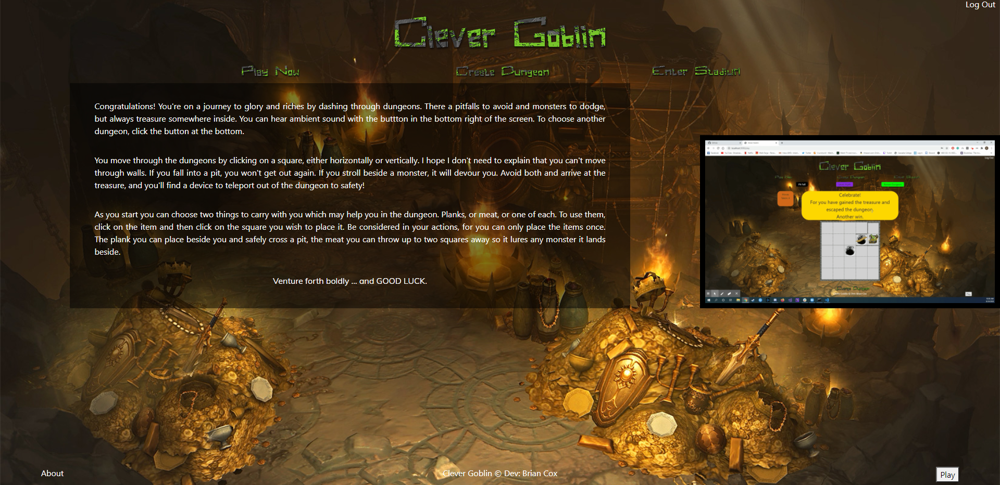
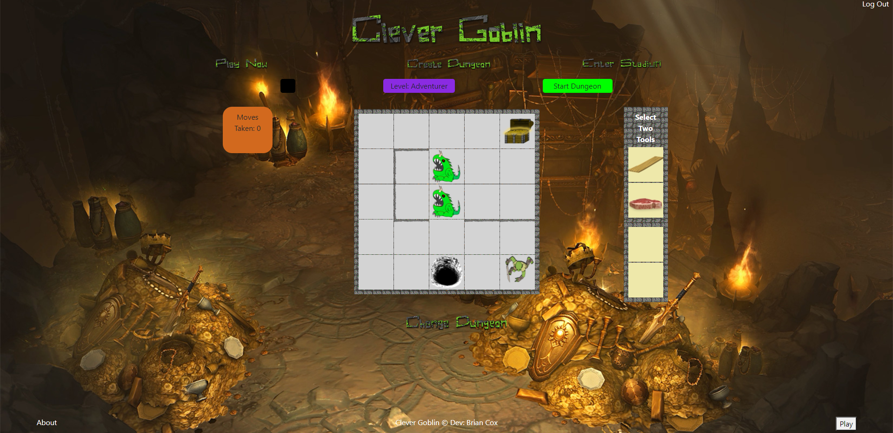
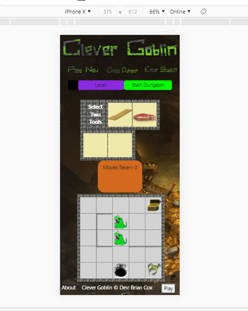

# Clever Goblin

## Description
​
An inter-player puzzle game, created to allow people to challenge their friends with their own user-created content. This is a MERN stack project using material UI for styling
​

## Installation
​
To install necessary dependencies, run the following command:
​
npm install
​
## Screenshots

​

## Technologies
Node.js
Express.js
passport
react
material UI
axios

## Questions
​

​
If you have any questions about the repo, open an issue or contact [papabear2009](https://github.com/papabear2009) directly at .
